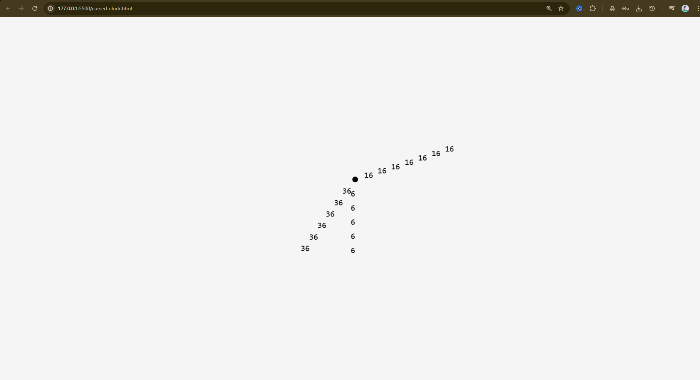

# Number_Clock
It is a Special Clock which Works on Real World Time. Don't consider it a normal clock because this Clock's Hands are made out of Numbers.

## Features
- Works on Real World Time.
- It's Hand are made out of Numbers (i.e. Seconds, minutes, Hours).
- It starts with the exact time as the system on which it Runs.
- Runs on HTML web page

## Preview

## Technology Used!
[HTML5](https://img.shields.io/badge/html5-%23E34F26.svg?style=for-the-badge&logo=html5&logoColor=white)

## Created By

- Atul Agrawal [@Newbie-coder91](https://www.github.com/Newbie-coder91)

